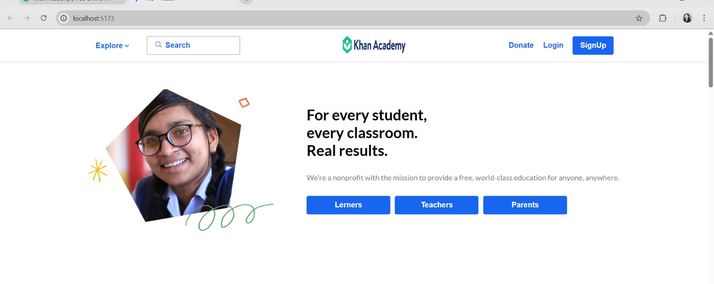
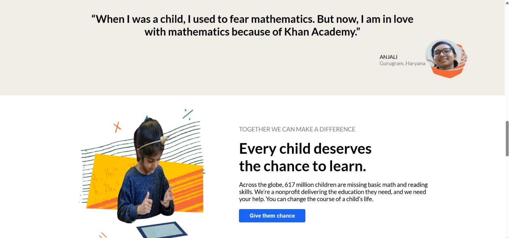
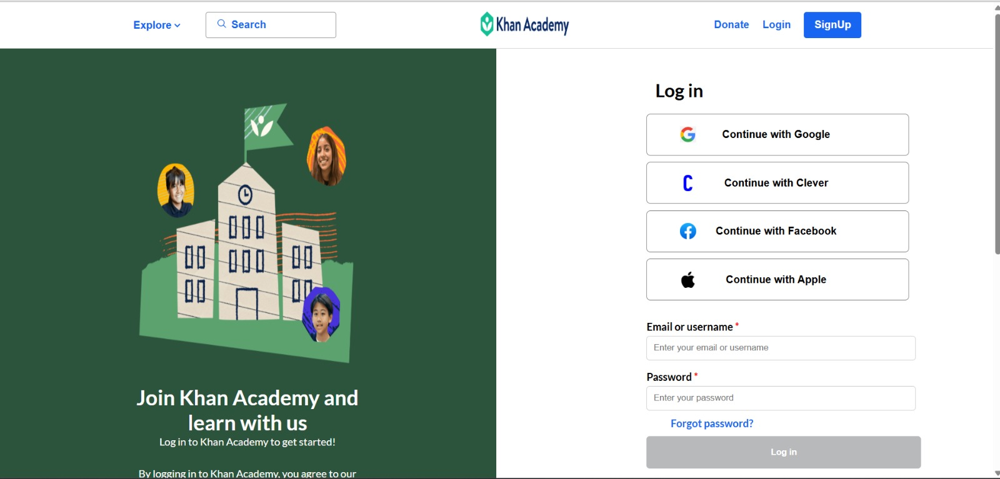

# KhanAcademy Clone

Welcome to the KhanAcademy Clone project!  
This is a UI development for the KhanAcademy website.

---

## 🚀 Features

- **User Authentication Pages:**

  - **Signup & Login** Pages for a personalized experience.
  - Secure user authentication.

- **Home Page:**

  - A dynamic homepage showcasing sections for Teachers, Learners, Parents.

---

## 🛠️ Technologies Used

- **Frontend:** HTML, CSS, JavaScript (React.js)

## 📂 Project Preview

## Home 🏡

## Hero Page

## Signup

## Login

